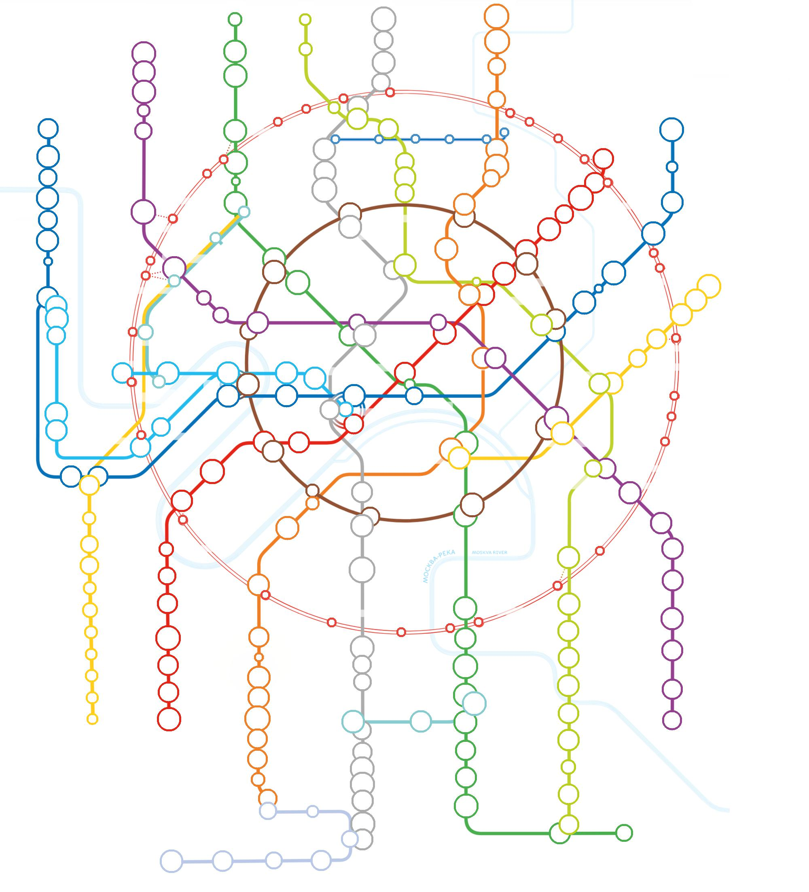

# Moscow-Underground-Analysus
This is one of my first big python projects. It started with me discovering [Google Trends](https://trends.google.com/trends/). Then travelling back home on the Subway (Metro) I thought why not create a map of metro with popularity of each station as a circle. In future I may update it to more than Moscow map.

